> [!TIP]
> 这篇是一晚上的完整实战记录：把一台没有公网 IP 的 Windows 笔记本，通过 Cloudflare Tunnel 变成一台免费、自带 HTTPS、开机自启的"云上服务器"，并让 ShunCode 的 Bridge 服务通过自有域名被公网（和远程 AI 智能体）访问。所有坑都踩过一遍，全部记录在案。

## 开篇：ShunCode Bridge 的 Cloudflare Named Tunnel 配置

故事的起点是 ShunCode 的 Bridge 功能——它能把本机的 ShunCode 工作区暴露成一个 **MCP 服务**，让远程的 AI 智能体（ChatGPT、Arena、WorkBuddy 等）连进来操作你的工作区。Bridge 面板里内置了 **Cloudflare Named Tunnel** 模式，配置界面长这样：

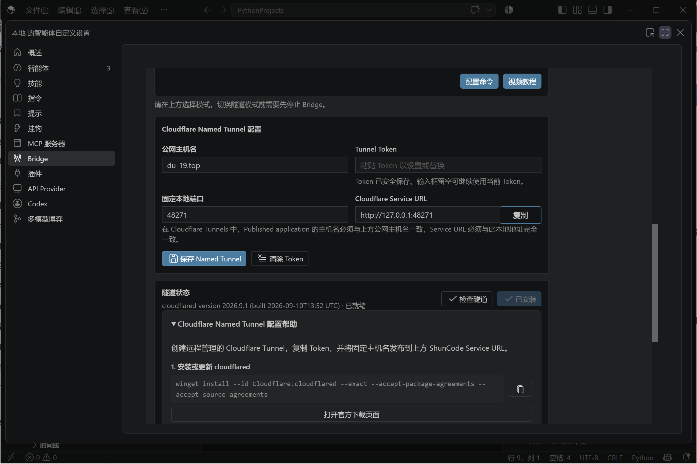

四个字段，一个都不能错：

| 字段 | 填什么 | 关键点 |
| :--- | :--- | :--- |
| 公网主机名 | 你想用的域名，如 `bridge.example.com` | 必须和 Cloudflare 后台 Published application 的主机名**一字不差** |
| Tunnel Token | Cloudflare 隧道的一长串 token（`eyJ...`） | 在 Zero Trust 后台创建隧道时获取，只显示一次 |
| 固定本地端口 | Bridge 服务监听的端口（我的是 `48271`） | 和隧道的 Service URL 必须完全一致 |
| Cloudflare Service URL | `http://127.0.0.1:<端口>` | 隧道收到流量后转发到的本地地址 |

面板自带的帮助把这总结成四步：装 cloudflared → 建隧道拿 token → 加 Published application 路由 → 检查 DNS 记录。

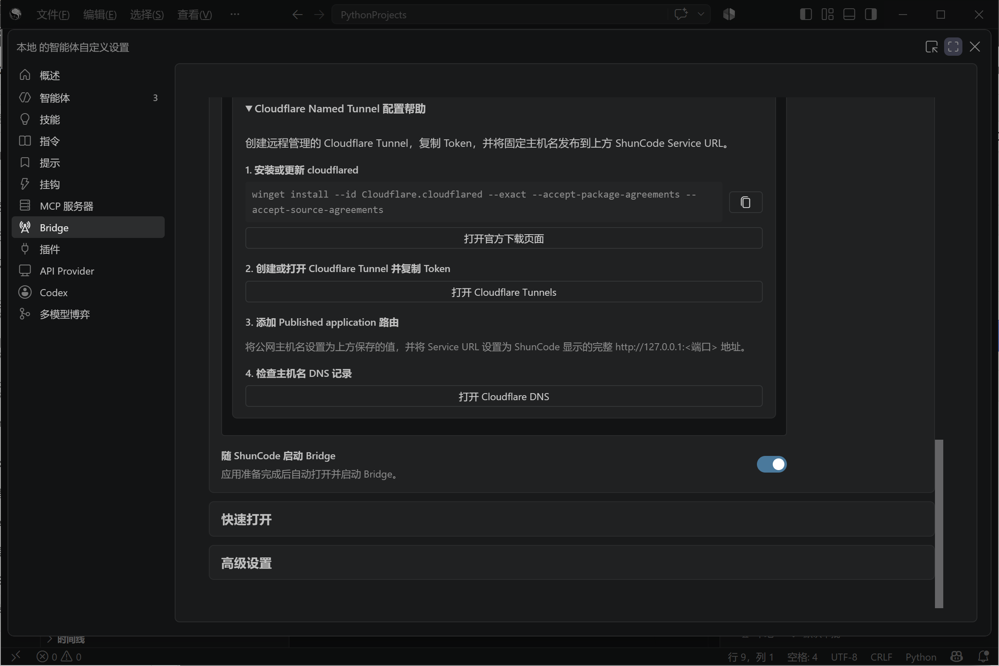

看起来只有四步，但实际走下来，每一步都有坑。下面是完整过程。

## 起点：Bridge 面板与账号授权

刚开始时 Bridge 面板长这样——「连接设置」一栏明晃晃写着**尚未安装 cloudflared**，账号授权也需要先处理：

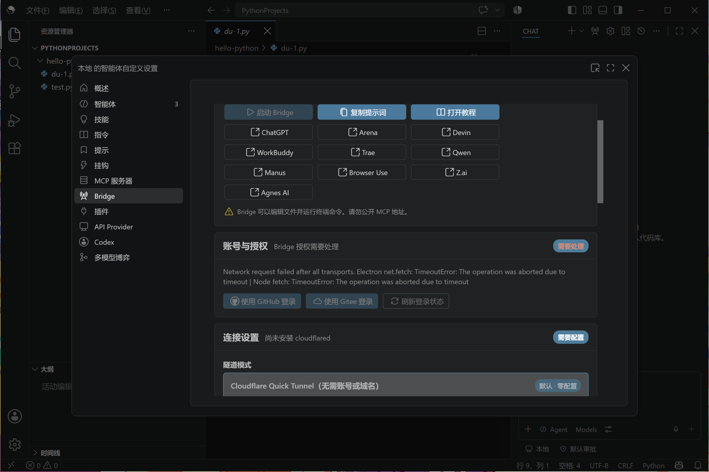

先用 GitHub 账号完成 Bridge 的授权登录：

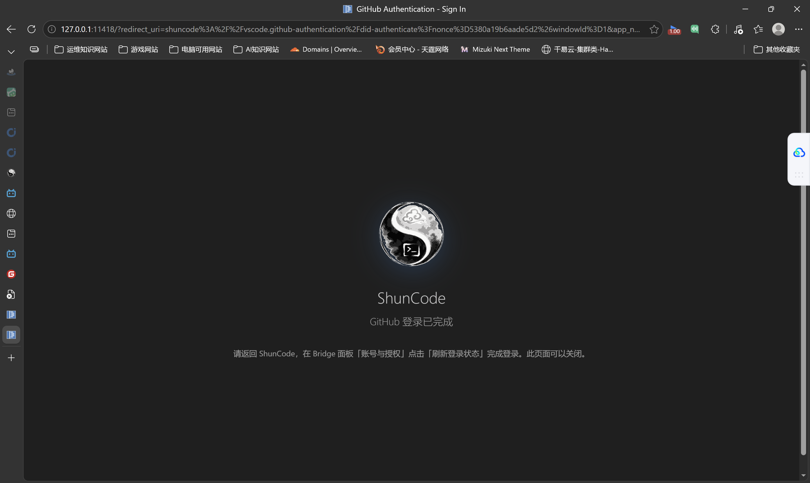

授权完成后，就进入正题：安装 cloudflared，把隧道模式从默认的 Quick Tunnel（无需账号、临时域名）升级为 **Named Tunnel**（自有域名、长期可用）。

## 第一步：安装 cloudflared，一个"静默失败"的权限坑

从 [cloudflared 的 GitHub Releases](https://github.com/cloudflare/cloudflared/releases) 下载 `cloudflared-windows-amd64.msi`，安装后它位于 `C:\Program Files (x86)\cloudflared\cloudflared.exe`。

然后**以管理员身份**运行隧道安装命令（token 在 Zero Trust 后台创建隧道时获取）：

```powershell
cloudflared.exe service install <你的隧道token>
```

> [!WARNING]
> 这一步有个非常阴的坑：**如果终端不是管理员权限，这条命令会"静默失败"**——没有任何报错，但 Windows 服务根本没创建。排查这种问题的正确姿势是先验证前提：`cloudflared service install` 需要写服务控制管理器（SCM），先确认 `IsAdmin` 再执行，能省掉一轮瞎猜。

成功的验证方式：

```powershell
Get-Service cloudflared
# Status: Running  /  StartType: Automatic
```

服务注册为**开机自启**后，这台机器和 Cloudflare 之间的加密隧道就常驻了。

## 插曲：www 跳根域的 301 重定向

既然域名已经在手，顺手把 `www.du-19.top` → `du-19.top` 的 301 重定向也配了。Cloudflare 有现成模板（Redirect Rules → `redirect-www-to-root`），核心配置：

- 匹配条件：`(http.host eq "www.du-19.top")`
- 重定向类型：**动态**（Dynamic），表达式 `concat("https://du-19.top", http.request.uri.path)`
- 状态码：**301**，勾选 Preserve query string

配完 Cloudflare 立刻给了个黄色警告："您的 DNS 配置可能不是 www 的代理流量"。这是 90% 的人都会踩的坑：

> [!CAUTION]
> **规则要生效，请求必须先到达 Cloudflare 的边缘节点。** 如果 `www` 没有 DNS 记录，或者记录是灰色云（仅 DNS），流量根本不经过 Cloudflare，规则就是摆设。解决办法是补一条占位记录：`A` 记录，名称 `www`，内容 `192.0.2.1`（RFC 保留地址），**代理状态必须是橙色云（已代理）**。

## 冲突：根域已经被 Pages 站占了

回到正题。打开 DNS 记录页准备给隧道配主机名时，发现一个致命问题：

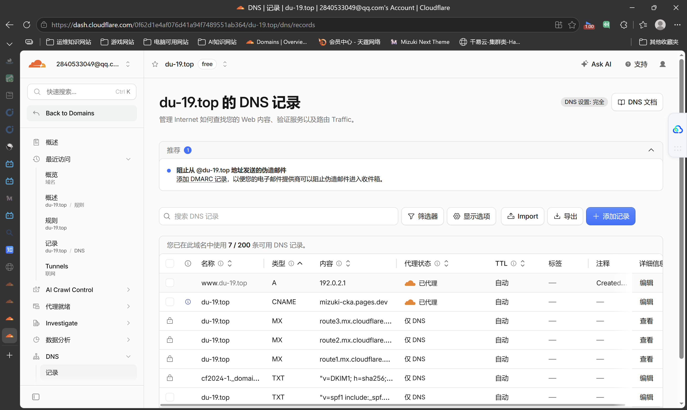

注意第二行：`du-19.top` 是一条 CNAME，指向 `mizuki-cka.pages.dev`——**根域已经是这个博客（Cloudflare Pages）的地盘了**。而我在 Bridge 面板里填的公网主机名恰恰是 `du-19.top`。也就是说就算隧道跑起来，访问根域的流量也只会去 Pages 站，永远到不了本机的 48271 端口。

> [!NOTE]
> **一个主机名只能有一个主人。** DNS 解析是路由的第一站，主机名指向谁，流量就去谁那。这个原则后面还会再救我一次。

决策很简单：博客要保留，Bridge 改用子域名 `bridge.du-19.top`。两边同步改——Cloudflare 隧道路由和 Bridge 面板的"公网主机名"。

## 第二步：给隧道添加 Published application 路由

进 Zero Trust → 网络 → Tunnels，点进自己的隧道，切到「路由」标签——好家伙，**一条路由都没有**，这就是根域访问不到 Bridge 的直接原因：

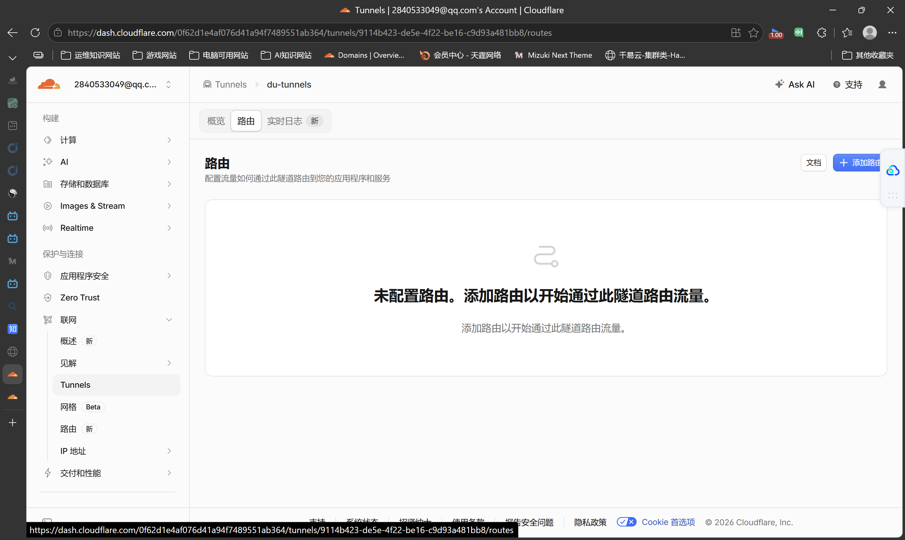

点「添加路由」，四个选项里选**已发布的应用程序**（通过公共主机名将本地应用发布到互联网）：

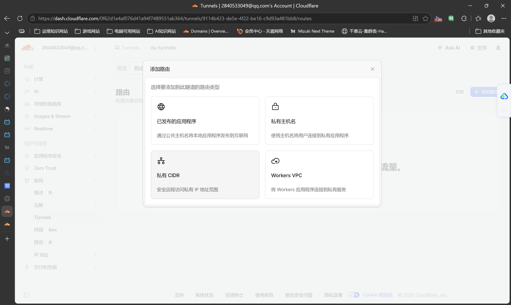

- **私有主机名**：Zero Trust 内网用户专用，需要装 WARP 客户端，公网访问不了
- **私有 CIDR**：路由整个 IP 网段，做内网组网用的（把笔记本变成 VPN 入口，这是后话）
- **Workers VPC**：对接 Workers 的私有服务

进入表单后注意一个细节：**子域名栏被预填了 `www`，必须改掉**——`www` 半小时前刚被我分配给 301 重定向，一个主机名不能有两个主人：

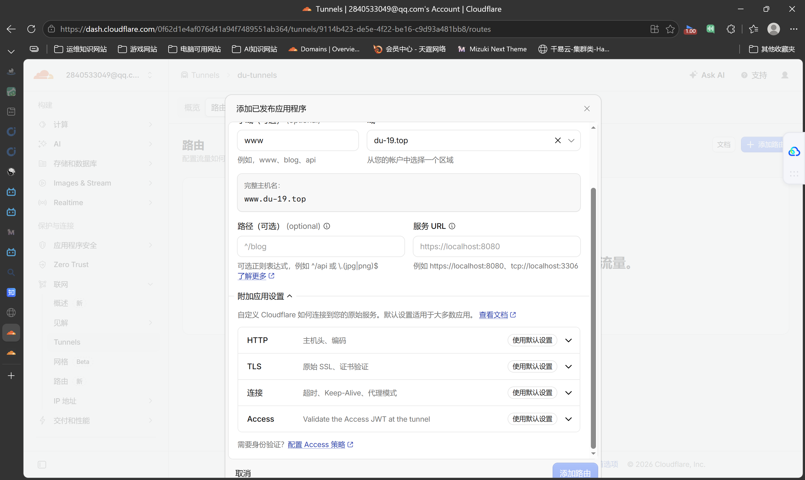

最终配置：

| 字段 | 值 |
| :--- | :--- |
| 子域名 | `bridge` |
| 域 | `du-19.top` |
| 路径 | 留空 |
| 服务 URL | `http://127.0.0.1:48271` |

「附加应用设置」里的 HTTP / TLS / 连接 / Access 四项全部保持默认。保存后完整主机名 `bridge.du-19.top` 生效，Cloudflare 会自动创建对应的 CNAME 记录（指向 `<隧道ID>.cfargotunnel.com`）——这就是"检查主机名 DNS 记录"那一步要确认的东西。

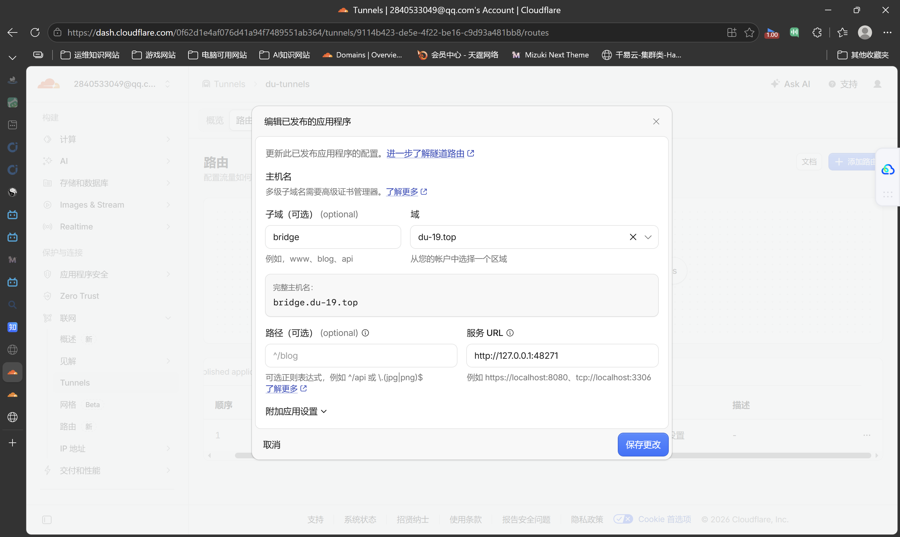

## 第三步：502 排障——三图标定位法

路由配好，Bridge 面板的公网主机名也同步改完，兴冲冲打开 `https://bridge.du-19.top`——**502 Bad Gateway**：

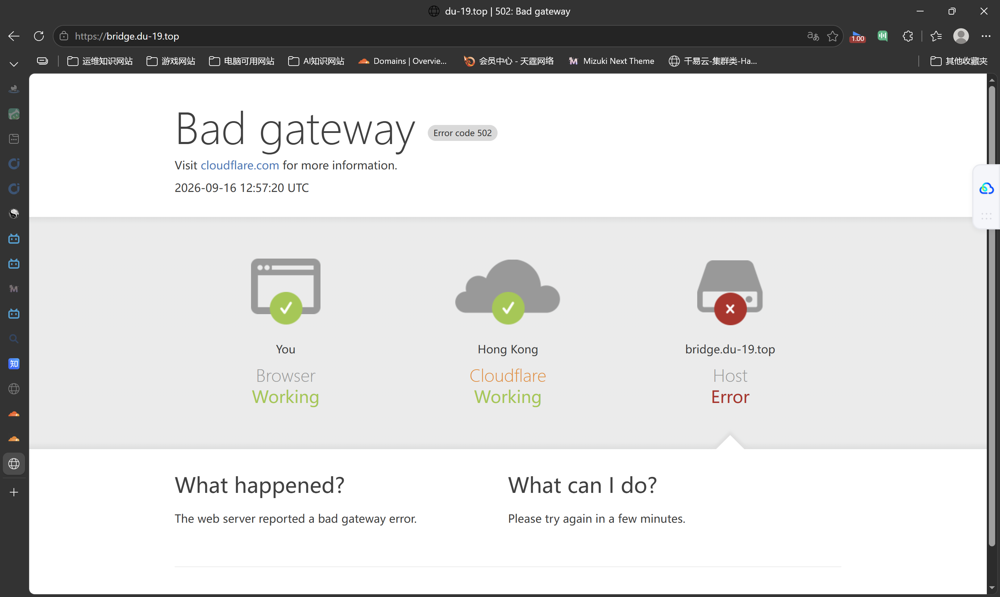

别慌。Cloudflare 的错误页面上那三个图标就是最好的排障指南：

- **You（浏览器）✅**：你这边没问题
- **Cloudflare（边缘节点）✅**：域名解析、CDN、隧道入口都正常
- **Host（源站）❌**：问题出在隧道出口之后——也就是我本机

请求已经穿过隧道到达我的电脑，但 cloudflared 去敲 `127.0.0.1:48271` 的门时**屋里没人**。一查端口监听：

```powershell
Get-NetTCPConnection -LocalPort 48271 -State Listen
# 查无此端口
```

原因哭笑不得：**Bridge 应用本身没启动**。隧道、DNS、路由全是通的，断在最后一环。回 ShunCode 启动 Bridge 后复查，48271 端口已经被 ShunCode 进程监听。

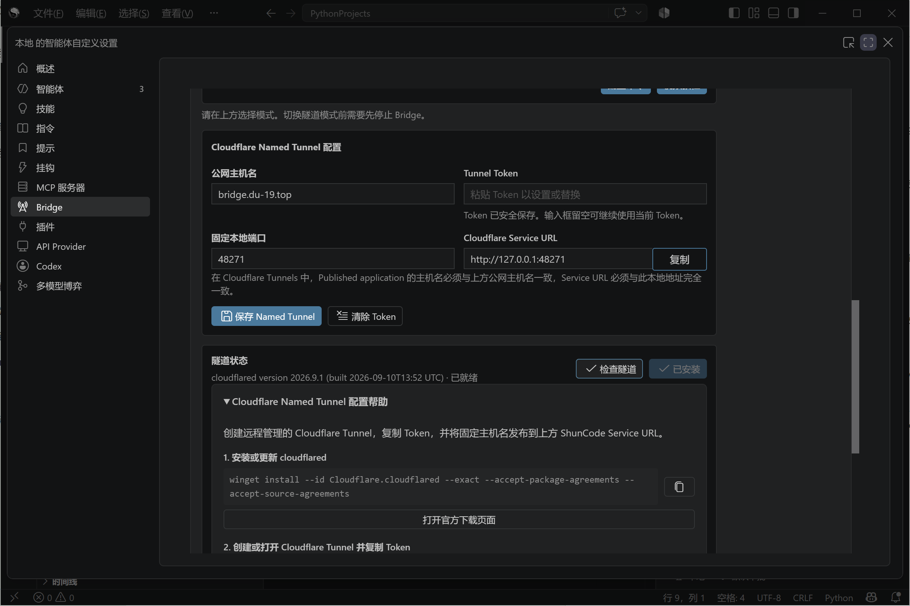

## 成功：一行 JSON 是最好的捷报

再次访问 `https://bridge.du-19.top`，浏览器显示：

```json
{"jsonrpc":"2.0","error":{"code":-32004,"message":"Not found"},"id":null}
```

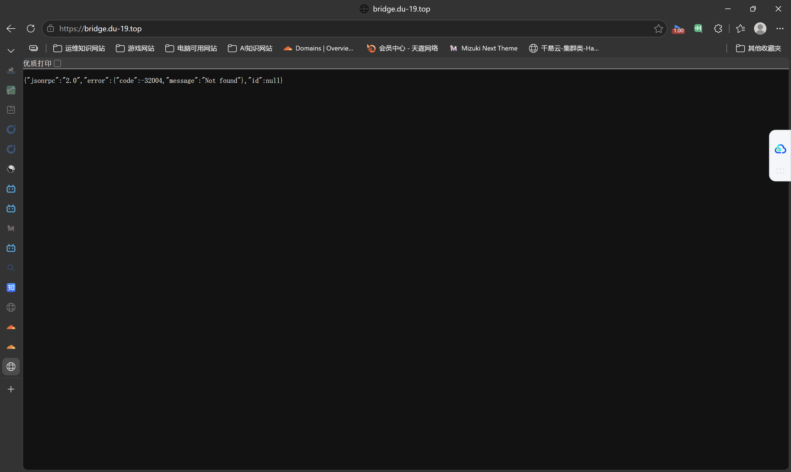

这不是错误页面，而是 **Bridge 服务本尊在应答**——它是个 JSON-RPC API 端点，根路径本来就没有网页。看到这段 JSON，说明请求走完了全程：浏览器 → Cloudflare 边缘 → 加密隧道 → 本机 cloudflared → Bridge。**全链路打通。**

## 终章：MCP 远程连接，隧道的真正价值

隧道通了就值了：Bridge 面板会生成一个形如 `https://bridge.du-19.top/mcp/<访问令牌>` 的 MCP 地址。把它发给远程 AI 智能体（下图是 Arena 的 Agent 模式），对方立刻握手成功：

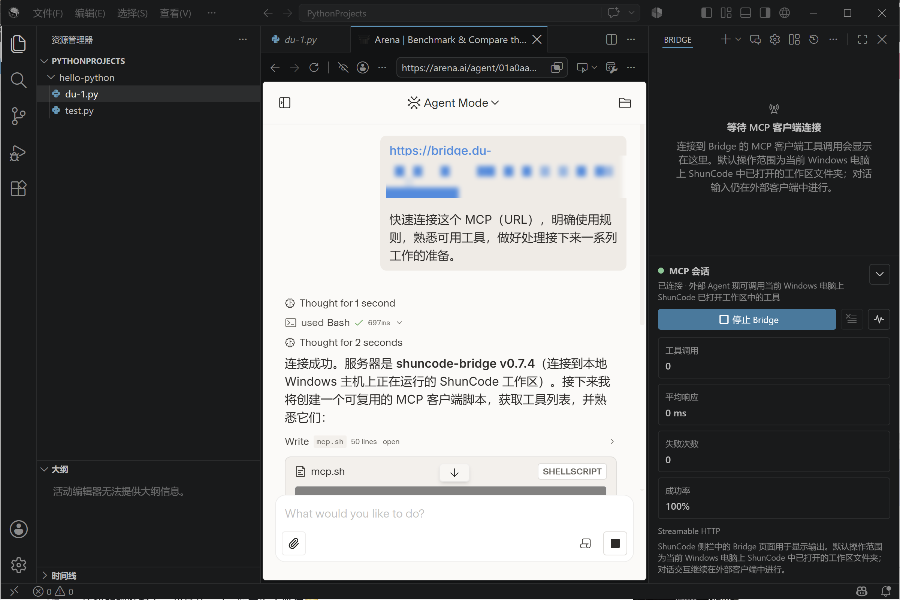

"连接成功。服务器是 shuncode-bridge v0.7.4（连接到本地 Windows 主机上正在运行的 ShunCode 工作区）"——从此远程 AI 可以直接操作我笔记本上的工作区：读写文件、跑终端命令，流量全程走 Cloudflare 加密隧道。

> [!CAUTION]
> **MCP 地址 = 你电脑工作区的钥匙**，谁拿到谁就能远程操作。所以：① 上面这张图里的令牌我已经打码，你也永远不要把完整 MCP 地址贴进任何公开场合；②  Bridge 面板自己也警告"请勿公开 MCP 地址"；③ 想再加一道保险，可以在 Zero Trust → Access 给 `bridge.du-19.top` 配一条邮箱验证策略，先过 Cloudflare 的登录墙才到得了服务。

## 复盘：一晚上的排障链

| 环节 | 症状 | 根因 | 解法 |
| :--- | :--- | :--- | :--- |
| 软件安装 | 服务创建"没反应" | 非管理员权限，静默失败 | UAC 提权后重装服务 |
| www 重定向 | 黄色警告 | www 无已代理的 DNS 记录 | 补 `A www → 192.0.2.1`（橙云） |
| 域名路由 | 流量去了 Pages 站 | 根域 CNAME 被博客占用 | Bridge 改用子域名 |
| 隧道路由 | 隧道里空空如也 | 从未发布过应用路由 | 添加 Published application |
| 本机服务 | 502 Bad Gateway | Bridge 应用没启动 | 启动 Bridge，端口开始监听 |

回头看，每一环的故障形式都不一样：**配置缺失是"警告"，路由冲突是"访问到错误站点"，服务没起是"502"**。遇到网关类错误先看 Cloudflare 错误页的三图标，哪个红了问题就在哪段——这比瞎猜快一个数量级。

## 这套基础设施还能干什么

隧道常驻、域名在手之后，这台笔记本就等于一台免费云服务器，往后的玩法都是同一套打法（起服务 → 加路由 → 验连通）：

- **挂更多本机服务**：影音库、文件管理、本地大模型 API，加条路由就上线
- **接收 Webhook**：AI 视频生成平台的任务回调、GitHub 事件，都有了公网接收地址
- **私有 CIDR + WARP**：把笔记本变成 VPN 入口，在外直接远程桌面回家
- **Access 策略**：给任何暴露的服务加登录墙

工具的价值不在于配置本身，而在于它把"我想在外面用到家里电脑"这件事，从每次求人变成了肌肉记忆。

> [!CAUTION]
> 本站分享的内容均为个人实战经验记录。文中涉及的域名、隧道 token、MCP 令牌等敏感信息均已脱敏，请勿在公开渠道泄露你自己的同类凭据。
