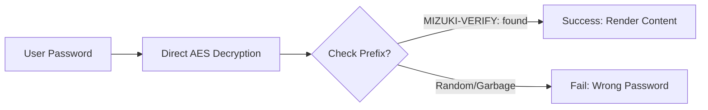

这个博客模板是用[Astro]（https://astro.build/）建立的。对于本指南中没有提到的事情，您可以在[Astro docx]（https://docs.astro.build）中找到答案

## Front-matter of Posts

```yaml
---
title: My First Blog Post
published: 2023-09-09
description: This is the first post of my new Astro blog.
image: ./cover.jpg
tags: [Foo, Bar]
category: Front-end
draft: false
---
```


| Attribute     | Description                                                                                                                                                                                                 |
|---------------|-------------------------------------------------------------------------------------------------------------------------------------------------------------------------------------------------------------|
| `title`       | 帖子的标题。                                                                                                                                                                                                 |
| `published`   | 帖子发布的日期。                                                                                                                                                                                             |
| `pinned`      | 此帖子是否被固定在帖子列表的顶部。                                                                                                                                                                             |
| `description` | 该职位的简短描述。显示在索引页上。                                                                                                                                                                             |
| `image`       | 文章的封面图片路径。以“http://”或“https://”开头：使用web图像2。以“/”开头：对于“public”目录下的图像没有前缀：相对于markdown文件                                                                                     |
| `tags`        | 帖子的标签。                                                                                                                                                                                                 |
| `category`    | 职位的类别。                                                                                                                                                                                                 |
| `alias`      |  邮件的别名。该帖子将在‘ /posts/{alias}/ ’上访问。例如：‘ my-special-article ’（可在‘ /posts/my-special-article/ ’找到）                                                                                         |
| `licenseName` | 帖子内容的license名称。                                                                                                                                                                                      |
| `author`      | 这篇文章的作者。                                                                                                                                                                                             |
| `sourceLink`  | 文章内容的源链接或参考。                                                                                                                                                                                      |
| `draft`       | 如果这篇文章仍然是草稿，将不会显示。                                                                                                                                                                           |
| `encrypted`   | 此帖子是否受密码保护。                                                                                                                                                                                        |
| `password`    | 解锁加密邮件的密码。                                                                                                                                                                                          |
| `passwordHint`| 提示，以帮助用户记住密码。下面显示密码输入。                                                                                                                                                                    |

## Where to Place the Post Files


你的帖子文件应该放在‘ src/content/posts/ ’目录下。您还可以创建子目录来更好地组织您的帖子和资产。

```
src/content/posts/
├── post-1.md
└── post-2/
    ├── cover.png
    └── index.md
```

## Posts alias

您可以通过在首页添加“alias”字段来为任何文章设置别名：

```yaml
---
title: My Special Article
published: 2024-01-15
alias: "my-special-article"
tags: ["Example"]
category: "Technology"
---
```

设置别名时:

- 文章将可以通过自定义URL访问（例如，‘ /posts/my-special-article/ ’），
- 默认的‘ /posts/{slug}/ ’ URL仍然有效，
- rss /Atom提要将使用自定义别名，
- 所有内部链接将自动使用自定义别名

**重要的笔记:**

- 别名不应该包括‘ /posts/ ’前缀（它将自动添加）
- 避免特殊字符和空格
- 在别名中使用小写字母和连字符为最佳SEO实践
- 确保别名是唯一的所有帖子
- 不要包括前导或尾斜杠

## How It Works



## Page Encryption

您可以通过设置“encrypted: true”并在首页提供“password”来密码保护任何帖子：

```yaml
---
title: My Private Post
published: 2024-01-15
encrypted: true
password: "my-secret-password"
passwordHint: "Hint: The password is my dog's name"
---
```

### Fields

| Field          | Required | Description                                              |
|----------------|----------|----------------------------------------------------------|
| `encrypted`    | Yes      | 设置为“true”以启用密码保护                                 |
| `password`     | Yes      | 解锁邮件的密码                                            |
| `passwordHint` | No       | 在密码输入下面显示提示，以帮助用户                          |

### How the Unlock Box Looks

解锁框显示:
- 主题的原色锁定图标，
- 帖子标题“密码保护”，
- 要求passwordA提示的描述（如果提供了‘ passwordHint ’），
- 密码输入字段和解锁按钮

输入正确的密码后，内容将被解密并显示。密码存储在会话存储中，因此用户不需要在同一会话中的后续页面加载时重新输入密码。
