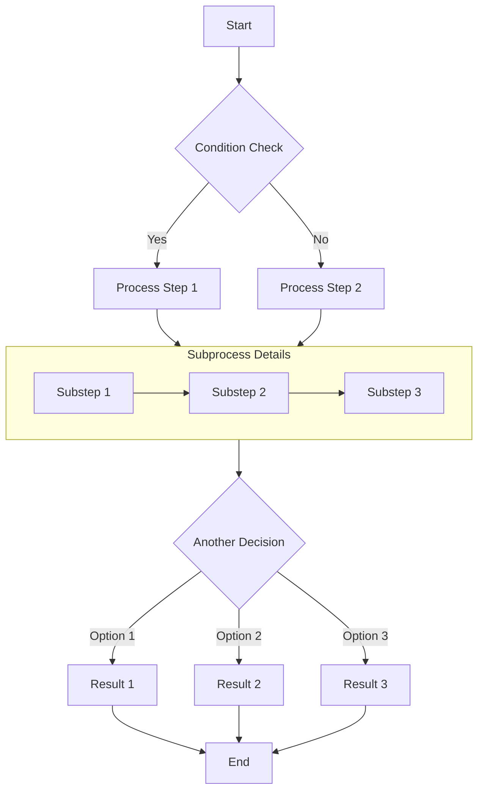
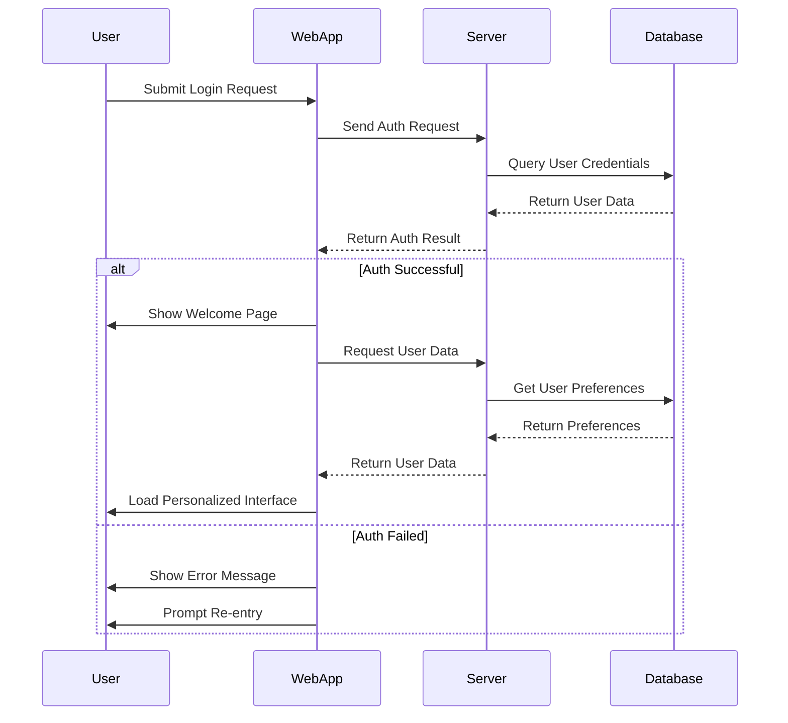
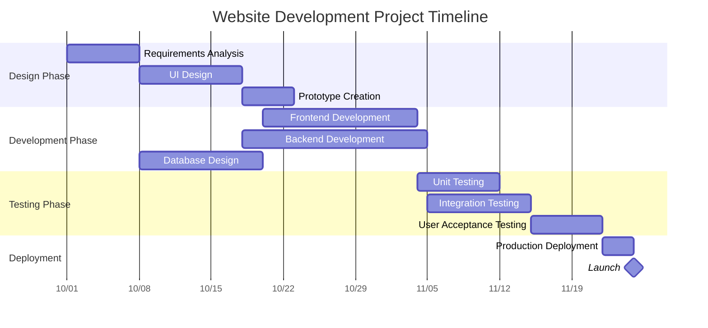
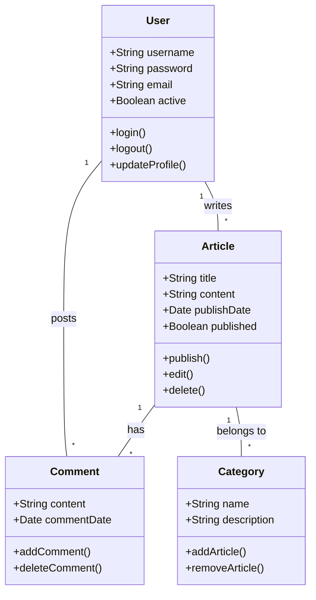
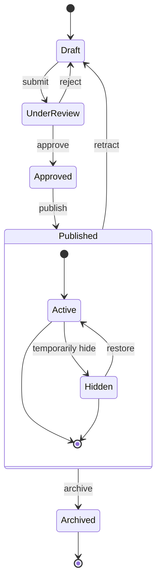
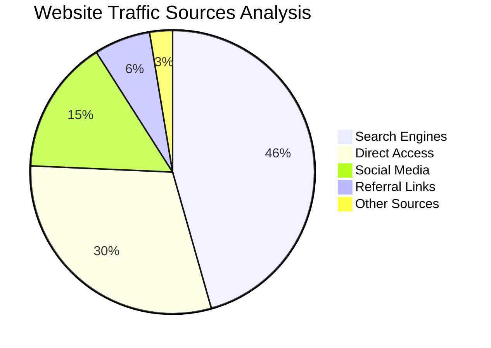

# Complete Guide to Markdown with Mermaid Diagrams

本文演示了如何在Markdown文档中使用Mermaid创建各种复杂的图，包括流程图、序列图、类图和状态图。

## Flowchart Example

流程图非常适合用于表示过程或算法步骤

## Sequence Diagram Example

序列图显示了对象之间随时间的相互作用。

## Gantt Chart Example

甘特图非常适合显示项目进度和时间表。

## Class Diagram Example

类图显示了系统的静态结构，包括类、属性、方法以及它们之间的关系。

## State Diagram Example

状态图显示对象在其生命周期中经历的状态序列。

## Pie Chart Example

饼图是显示比例和百分比数据的理想选择。

## Conclusion

Mermaid是一个强大的工具，用于在Markdown文档中创建各种类型的图表。本文演示了如何使用流程图、序列图、甘特图、类图、状态图和饼图。这些关系图可以帮助您更清楚地表达复杂的概念、过程和数据结构。

要使用Mermaid，只需在代码块中指定Mermaid语言，并使用简洁的文本语法描述图。Mermaid会自动将这些描述转换成漂亮的可视化图表。

尝试在你的下一篇技术博客文章或项目文档中使用美人鱼图，它们会让你的内容更专业，更容易理解！
